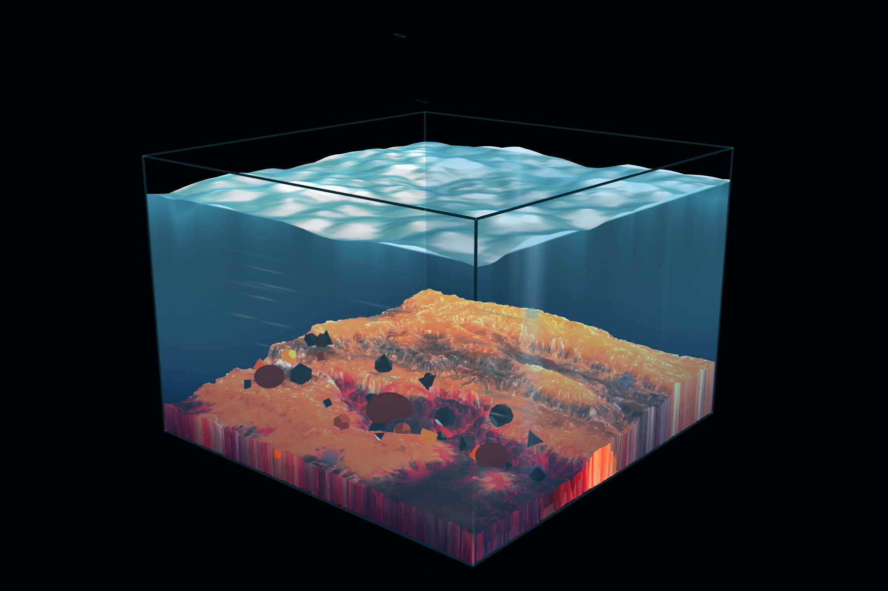
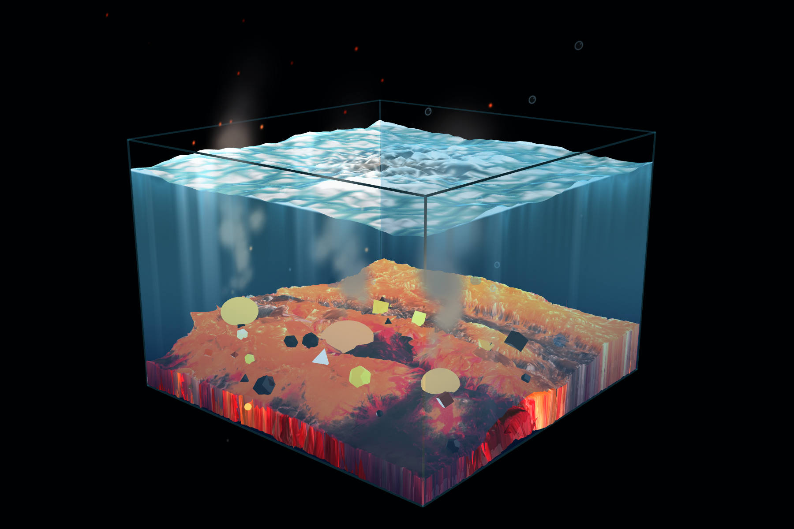

# Volcanic Seabed — A.R.T. & Crafts prototype

A working proof of concept for the first of the three phygital blocks in the
project plan: a hand-made resin block whose WebAR layer shows the magma, ash and
heat the resin can only hint at.

It is no longer a greybox. The seabed is the sculpt, with its own baked colour and
normal maps; it swells on its vertex normals as the plate heats; a sliced water
volume sits on top of it with a live surface that boils where the rock is hottest;
and the five Platonic solids crystallise out of the hot band, creep into the cold,
and set. Everything runs from one 0–1 heat value, and everything is bound to the
printed target at true scale.

The particles are textured, camera-facing sprites now — the last low-poly stand-ins
are gone.

**At rest** — the slider low, the plate cold, the surface glassy:



**Erupting** — the slider at the top and the vent freshly charged. The plate has
risen, the vent pool is white-hot, formations are glowing where they have just come
up, and the water is boiling above the vent:



Both are rendered from the running scene at the two ends of the same slider, with
the camera-feed background removed. Nothing is composited or retouched.

## What runs

| Piece | File | What it does |
| --- | --- | --- |
| Scene | `volcanic-seabed.ts` | Spawns the sculpt, lava seams, LEDs and block wireframe; drives everything from a single 0–1 heat value |
| Model pipeline | `../../tools/convert_seabed.py` | Turns the sculpted FBX into the GLB the engine loads, and bakes the volume-expansion morph target |
| Water | `water.ts` | The sliced water volume, its live surface, and the boil over the vent |
| Terrain | `terrain.ts` | Samples the sculpt so everything else can sit on it instead of guessing |
| Formations | `formations.ts` | Platonic solids crystallising out of the hot rock and creeping into the cold |
| Particles | `swarm.ts` | Ash, embers, gas and marine snow, as billboarded sprites |
| Sprites | `../../tools/make_particle_textures.py` | Generates the smoke, ember and bubble textures |
| Controls | `seabed-hud.ts` | Cooler / hotter buttons, temperature readout, heat bar |
| Hardware seam | `tectonic-charge.ts` | Tap-to-charge; fires the eruption and the LED signal, optionally over WebSocket |
| Contract | `events.ts` | The four global events the pieces talk over |

The parts never reference each other directly — they exchange global events. That
is deliberate: the induction/ESP32 loop has to be removable for workshops where
there is no coil on the table, without touching the rest.

## The seabed model

`src/assets/Models/TectonicSeabed.fbx` is the sculpt. The engine cannot load it:
`ecs.GltfModel` takes a `.glb`/`.gltf` URL and there is no FBX loader anywhere in
the runtime. So it is converted — and because the sculpt will be re-exported many
times before this is finished, the conversion is a script rather than a session in
Blender:

```powershell
.\tools\convert-seabed.ps1
```

Blender does not put itself on PATH on Windows, so typing `blender.exe` gets you
"The term 'blender.exe' is not recognized". `tools/convert-seabed.ps1` finds it, and
switches to the project root first — the script's paths are relative to the repo, not
to wherever the sculpt happens to live. Set `$env:BLENDER` to override which Blender
it uses. Everything you pass the wrapper goes straight through to the script.

That writes `src/assets/Models/TectonicSeabed.glb` and prints the numbers you need
in order to set `ventHeight`. What it does, and why each step is there:

| Step | Why |
| --- | --- |
| Decimate to 60k triangles | The raw sculpt is 598k. A phone drawing this at 30 fps behind a camera feed cannot afford that |
| Clear split normals, smooth, weld | The sculpt marks nearly every edge sharp. glTF cannot store two normals on one vertex, so 60k triangles were exporting as 142k vertices and the file was 4.2 MB. Smooth-shaded it is 31k vertices and 0.87 MB |
| Scale to block units | The sculpt is authored 100 mm across, which is one block unit by definition. The GLB comes out 1.0 x 1.0 x 0.175 units with its origin at the centre of its base, so it needs no transform in the scene |
| Bake the `Expand` morph target | The volume expansion, below |
| Bake the `_MASK` attribute | The same mask, for shaders |
| Wire up the baked maps | `--albedo` and `--normal`. The normal goes through a Normal Map node and is set Non-Color — any other wiring exports as nothing at all, silently |
| Draco compression | The runtime ships a Draco decoder at `external/runtime/resources/draco`, so this costs nothing |

`config/webpack.config.js` also keeps `*.fbx` and `*.blend` out of `dist`, and
`.gitignore` keeps them out of the repo — authoring formats the browser can neither
load nor afford to download.

The GLB is 3.65 MB with the baked maps: 1.15 MB of Draco-compressed geometry and
morph target, 1.37 MB of normal map and 1.13 MB of base colour. The maps are the
bulk, so `--texture-quality` is the dial that matters if it needs to be smaller.

## Volume expansion on the normals

The sculpt swells as the vent heats, driven by the same `heat` value as every other
response in the scene, scaled by `expandAtFullHeat` on the component.

**There is no vertex group in the GLB, because glTF has no such thing.** A Blender
vertex group is a named weight map, and it only survives an FBX export at all if it
is bound to an armature, as skin weights. The way to carry "these vertices, this
much" into a web runtime is to bake the weights into a vertex attribute. The
converter bakes them twice, because there are two ways to spend them:

**A morph target, which is what the scene uses.** Expansion along the normal is
linear in its amount:

```
p(t) = p + n * mask * A * t
```

so one shape key baked at `A` and lerped by `t` reproduces every intermediate
amount *exactly*. A morph target is not an approximation of this effect; it is the
effect. The runtime writes one float per frame into `morphTargetInfluences` and
does nothing else. No shader, no material patching, nothing that breaks when the
engine swaps a material out. `volcanic-seabed.ts` reaches the three.js mesh through
the `GLTF_MODEL_LOADED` event, which is the only route to it — the ECS attribute
layer has no morph API.

**A `_MASK` float attribute, for when a morph cannot do the job.** A morph target is
one fixed displacement field scaled by one number. The moment the swell has to vary
*over the surface as it grows* — per-vertex noise, a pulse travelling out from the
vent, one region leading another — it has to become a shader. Same event, then
patch the material:

```ts
mesh.material.onBeforeCompile = (shader) => {
  shader.uniforms.uExpand = {value: 0}          // drive this from the tick
  shader.vertexShader = shader.vertexShader
    .replace('#include <common>', `#include <common>
      attribute float _mask;
      uniform float uExpand;`)
    .replace('#include <begin_vertex>', `#include <begin_vertex>
      transformed += objectNormal * (_mask * uExpand);`)
}
mesh.material.needsUpdate = true
```

Note `objectNormal`, the *vertex* normal, in both routes. Offsetting each face along
its own face normal tears the surface open at every edge; the vertex normal is the
averaged face normal, so the surface inflates and stays closed. If you want visible
faceting, that is a shading decision rather than a displacement one.

### Do not export the sculpt to glTF straight out of Blender

Once the sculpt carries a Displace modifier that creates the swell, exporting it
applies that modifier: the seabed ships permanently expanded and nothing at runtime
can bring it back down. What the runtime needs is the *difference* between the two
states. Save the .blend and let the converter derive it:

```powershell
.\tools\convert-seabed.ps1 --in "..\..\Models\TectonicSeabed.blend" --object Mesher_LOD1.002 --shape-from modifiers --vgroup VentSwell
```

With the baked maps, which is what built the GLB in the repo:

```powershell
.\tools\convert-seabed.ps1 --object Mesher_LOD1.002 --shape-from modifiers --vgroup VentSwell --albedo "..\..\Models\Base Color_Out.png" --normal "..\..\Models\TextureBaker_Normals_2048.jpg"
```

Run with no `--in` at all and it finds the .blend by itself. The maps land in the GLB
as JPEG at quality 90 (`--texture-format AUTO` keeps them byte-for-byte instead, at
the cost of a 2.4 MB PNG staying 2.4 MB over a phone connection).

**The .blend is not in the repo, and that is deliberate.** The git repo is only
`Prototype/ARTandCrafts`; the sculpt lives beside it in `Digital Culture/Models`, at
68 MB. It is an authoring file — nothing at runtime ever opens it. What the app loads
is `src/assets/Models/TectonicSeabed.glb`, a few MB, and *that* is committed, so a
fresh clone and the Pages build have everything they need. Only the converter wants
the .blend, and only when you are re-exporting the sculpt.

So the answer to "will looking for it externally cause errors" is: not for the app,
and not for the build. Only for `convert_seabed.py`, on a machine where the sculpt is
somewhere else — and then it stops with a list of the paths it tried rather than a
stack trace. Point it wherever yours is:

```powershell
$env:SEABED_SOURCE = "D:\wherever\TectonicSeabed.blend"
.\tools\convert-seabed.ps1 --object Mesher_LOD1.002 --shape-from modifiers --vgroup VentSwell
```

The intermediate `TectonicSeabed.fbx` is gitignored for the same reason — 19 MB of a
format the engine cannot load and webpack already refuses to deploy.

`--shape-from modifiers` evaluates the stack twice, once with the Displace muted and
once with it live, and the difference becomes the `Expand` morph target. That is
strictly better than the `normals` default, which only knows how to inflate smoothly
along the vertex normal: the Displace keeps its texture detail, and a CorrectiveSmooth
sitting above it is accounted for rather than fought with, because it runs in both
passes.

`--object` is required when the file holds more than one mesh — a working .blend
usually has a camera, a light, a cube and several LODs in it, and guessing between
them fails quietly. Run without it and the script lists what it found.

Two properties of this that were measured rather than assumed:

- **Muting the Displace gives back the undeformed sculpt.** A CorrectiveSmooth set to
  Original Coords has nothing to correct once the deformation is gone, so the rest
  pose is the sculpt itself and not a smoothed version of it.
- **The live evaluation is bit-identical to what the glTF exporter writes**, since
  both come from the same whole-stack depsgraph evaluation. The morph lands exactly
  on the shape in the viewport, not near it.

The swell is measured **first**, on the mesh exactly as authored, and carried down
through decimation as a `FLOAT_VECTOR` vertex attribute. It cannot be measured later,
and both reasons cost real accuracy on this sculpt:

- **Decimating first breaks the CorrectiveSmooth.** Its Original Coords rest
  reference is the 299,158-vertex mesh; decimate to 30,001 and Blender warns
  "Original vertex count mismatch" and the smoothing stops matching. The swell came
  out 25% short — peak 11.18 against the correct 14.95.
- **Smoothing normals first changes the displacement.** A Displace set to
  Direction: Normal moves each vertex along its vertex normal, so clearing the
  sculpt's custom split normals before evaluating it quietly redirects every offset.

There is a trap next to this worth knowing about even outside this pipeline:
**applying the modifiers one at a time in the UI does not give the shape you see.**
Baking the Displace moves the Original Coords that the CorrectiveSmooth measures
against, so the smoothing silently stops happening — measured at 2.3 source units of
divergence on a test stack. Either evaluate the whole stack at once (Object ›
Convert › Mesh) or let the converter do it.

If the swell is too subtle once it is running, `--shape-gain 2.5` multiplies it at
bake time. The `expandAtFullHeat` parameter in Studio can only scale it *down* from
whatever is baked in, so the headroom has to be built here.

### Painting the mask yourself

The sculpt has no vertex groups at all, so out of the box the converter stands one
in: a smoothstep radial falloff around the vent, full inside `--inner` and zero
beyond `--outer`. To author it properly, paint it in Blender — **you do not bake
anything by hand, the converter does that.** The only thing to get right is which
container the mask travels in, because the two obvious choices do not behave the
same way:

| Painted as | Survives FBX? | Use |
| --- | --- | --- |
| Vertex group (Weight Paint) | **No** | `--in sculpt.blend --vgroup VentSwell` |
| Colour attribute (Vertex Paint, greyscale) | Yes | `--in sculpt.fbx --vcolor SwellMask` |

**A vertex group does not survive an FBX export.** FBX only stores vertex groups as
armature skin weights, so a group painted onto a plain sculpt is dropped on the way
out — silently, with no warning from either end. This is worth knowing before
spending an evening painting one. If you want to work with vertex groups, save the
.blend and point the converter at that instead of at the FBX; it opens .blend,
.fbx, .glb and .obj:

```powershell
.\tools\convert-seabed.ps1 --vgroup VentSwell --amount 0.08
```

In Blender: select the mesh, Object Data Properties › Vertex Groups › **+**, name it,
then Weight Paint mode and paint. White is 1 and expands fully, black is 0 and does
not move.

**A colour attribute does survive**, which is the route to use if the sculpt has to
arrive as an FBX. Vertex Paint mode, paint in greyscale, and the converter averages
the channels back into a weight:

```powershell
.\tools\convert-seabed.ps1 --vcolor SwellMask
```

It comes back on the corner domain as 8-bit colour whatever it was when it left, so
weights land on 1/255 steps rather than exactly where you put them. For a swell mask
that is invisible; do not use it to carry anything that needs precision.

`--amount` is the displacement in block units at weight 1, so the default 0.06 is
6 mm of swell.

## The eruption envelope

Charging the vent used to be a step function: the tap put the whole burst on in a
single frame, which showed up as the readout jumping 438 degrees at once and the
seabed snapping to full swell before it had visibly begun. Now the burst has an
attack, a hold and a release — `burstRise`, `burstHoldTime`, `burstFall`.

Measured over a simulated tap at 60 fps:

| | before | after |
| --- | --- | --- |
| largest single-frame change | 438 C | 6 C |
| seconds above 0.6 heat | 1.82 | 4.22 |
| seconds above 0.8 heat | 0.60 | 2.50 |
| peak | 1118 C | 1120 C |

The peak is deliberately unchanged — the tap is worth the same amount of heat, it
just takes 1.4 seconds to get there and stays at the top for 1.6 before the old decay
takes over. `burstPeak` doubles as the phase marker: non-zero means still climbing or
holding, zero means falling, which keeps the whole envelope inside two floats of the
component's `data` schema.

The rise is specified in seconds-to-peak rather than units-per-second on purpose. A
second tap part-way through should not take longer just because the vent is already
warm — it raises the ceiling, refreshes the hold, and still arrives at the top on
time.

## The water surface highlight

Two additions that both exist to answer the same question — *where is the top of the
water* — from the two directions you can look at the block from.

**Looking down**, a specular highlight on the surface: a broad sheen for direction
and a tight glint that catches the faces of waves as they turn. Both are computed in
**object space**, against a light fixed above the block. A view-space light is a head
torch: the glints slide around as the phone moves and the water reads as wet plastic.
The block does not move relative to the printed target, so a light fixed in its space
stays put the way a window does.

That the glints exist at all depends on the wave normal genuinely tilting, which it
does — up to about 25 degrees at the steepest, from the finite difference already
being computed for the shading.

**Looking from the side**, a bright meniscus a few millimetres thick where the
waterline crosses each cut face. It follows the wave down, and it is masked to the
walls only, because a cut through water is not a surface and should not reflect
anything. `vTop` separates the two, read off the *undisplaced* box normal before the
wave overwrites it — the only clean way to tell them apart, since the top row of a
wall shares its position with the surface.

`waterSpecular` and `waterLineWidth` are both in the Inspector; 0 turns either off.

## Sitting on the sculpt instead of guessing where it is

Everything that used to float — the vent, the lava seams, the LEDs — floated for one
reason: the code knew the shape it *wanted* the terrain to be, a cone with a summit
at a computed height, and the terrain stopped being that shape the moment a sculpt
replaced it. `terrain.ts` fixes it at the root by sampling the real surface once the
GLB has loaded, into a 56 x 56 grid of heights and mask weights.

Two heights per cell, not one. The plate swells by up to 140 mm as it heats, so
"where is the surface" has two answers and the live one is between them — `heightAt`
takes the morph influence and interpolates, which is *exact*, because the morph is
itself linear in that influence. Roughly one cell in twelve catches no vertex after
decimation, so holes are dilated closed from their neighbours; left alone they read
as pits that anything standing on them falls through.

A grid rather than raycasting: 30,000 vertices splat in once, and every lookup after
that is four reads and a lerp. Raycasting per formation per frame is the same answer
for far more work, and would have to be redone every time the swell moved.

**The jet cone is gone.** It belonged to the greybox seamount, where it stood in a
crater on a summit. On the sculpt there is no summit for it to stand in, so it hung
in the water attached to nothing. The ash column already says something is venting.

**The vent is not at the centre of the block.** It is at the mask-weighted centroid
of the VentSwell group, `(-0.061, 0.140)` in block units — `(43.9, 64.0)` in
millimetres from the corner — because that is the middle of the hot band rather than
the middle of the block. Its *height* is re-read from the sculpt every frame, since
the rock under it climbs from 0.024 to 0.111 as the plate heats. `ventX`, `ventZ`
and `ventLift` are all in the Inspector.

## Smoke, and where it comes from

The ash used to be `TetrahedronGeometry`. At the size a particle is drawn on a phone
a tetrahedron is four flat facets and a hard silhouette — it reads as debris however
it is coloured, and it was the last thing in the scene that looked like placeholder
geometry. It is a textured quad turned to face the camera now: two triangles instead
of four, and it reads as smoke at any size.

`tools/make_particle_textures.py` generates the three sprites — smoke, ember, bubble
— as white images with the shape entirely in the alpha channel, so the swarm can tint
them from the same magma ramp as everything else. The seed is fixed, so re-running it
produces byte-identical files rather than churning the repo.

Two things that had to be measured rather than guessed:

- **Noise frequency.** Five octaves from a three-cell base gave five-pixel speckle
  that looked like sensor noise. Three octaves from two cells gives a few soft lobes,
  which is what survives being drawn forty pixels across.
- **Density.** The first texture averaged 0.09 alpha across the quad, so a particle at
  0.45 material opacity laid down about four percent coverage and the column was
  invisible over bright water — a solid tetrahedron had been doing ten times that.
  It averages 0.19 now, at higher opacity.

Billboarding is worked out once per swarm per frame, not once per particle: they all
share a parent, so they all share the rotation. It is read off `matrixWorld` rather
than from an Object3D's `quaternion`, for the same reason as everywhere else in this
project — the runtime composes matrices from its own transform store and the
decomposed properties are not reliable. One frame of lag on a billboard is invisible.
Smoke and marine snow also carry a fixed random roll, or every puff in the column is
the same picture at the same angle and the eye picks it out immediately.

### Several vents, not one

The mask describes a *band* across the plate, not a point, so one chimney in the
middle of it was the wrong reading of the art. `ventCount` (3 by default) spreads
emitters along the ridge by farthest-point sampling over the cells the mask calls
hottest, and each one gets its own pool, its own surface height and its own breathing
phase — so the plate reads as several independent things venting rather than one
thing copied.

Two details that cost a round trip each:

- **The first vent is seeded, not searched.** Farthest-point sampling from scratch
  discards the hand-tuned `ventX`/`ventZ`; seeding the search with it keeps the main
  vent where it was put and finds the others around it.
- **Candidates are inset from the rim.** Unconstrained, the sampling walks straight to
  the corners of the footprint — two of three vents landed at x = ±0.49, half inside
  the edge of the block with their columns rising outside it.

## Mineral formations

The five Platonic solids, crystallising out of the hot rock and setting in the cold.
They are the vertex mask made legible: each one is born where the mask is strong,
creeps outward down its gradient, cools as it goes, and freezes. Then it fades and
another comes up behind it. The temperature slider changes how fast the cycle runs
and how far each one gets before it sets.

Two things worth writing down.

**`faces: 6` builds nothing.** `ecs.PolyhedronGeometry` covers four of the five —
measured, `4` gives 12 vertices, `8` gives 24, `12` gives 60, `20` gives 108, and `6`
gives an empty geometry. The cube is a `BoxGeometry` with equal sides, scaled to the
cube inscribed in the same sphere so it carries the same visual weight as the others.

**The mask saturates, so the gradient goes flat.** Weight 1 covers about a third of
the footprint, and inside that plateau the gradient is exactly zero — six of
twenty-six formations spawned somewhere it mattered. Where the gradient vanishes,
`maskGradient` falls back to the direction away from the mask centroid, so a
formation in the middle of the band still has somewhere to go until it reaches the
edge and the real gradient takes over.

## A trap in the ECS: `object.position` is always zero

The runtime keeps transforms in its own store and composes `object.matrix` from them
directly. `object.position` on an entity's `Object3D` stays at the origin no matter
where the entity actually is — so reading a position back off three.js and writing it
somewhere is a quiet way to move everything to the centre of the block. It cost one
bug here, in the code that drops the seams and LEDs onto the rock.

Keep the authoritative value yourself, in the component's own state, or read the
world transform through `world.getWorldTransform(eid, mat)`. `world.setPosition`
works fine going the other way; it is only the read that lies.

## The water volume

A section through a body of water rather than a blue lid on top of one: a box the
full footprint of the block, from the seabed up to `waterLevel`, with its cut walls
showing the column and its top face alive.

### How the surface and the cut walls stay in register

This is the part that looks like it needs two systems and does not. The worry is that
the top face gets displaced by the wave function and the four cut walls do not, so
the volume tears open along its top edge — and the fix people reach for is to run the
same distortion over the whole volume, which is the expensive answer to a question
that has a free one.

Make the displacement a function of where a vertex is *in plan*, and nothing else:

```
y += wave(x, z) * depthMask(y)
```

A vertex at the top edge of a wall has the same `(x, z)` as the surface vertex above
it, so it gets exactly the same offset. They match by construction rather than by
being matched, and there is no seam to close because there was never a gap.
`depthMask` is 1 at the waterline and cubed off with depth, so the motion dies out
below the surface the way a real wave does and the base stays flat on the sculpt.

So it is one mesh, one draw call, one shader. The wall vertices run the same code the
surface vertices run and most of them multiply the result by nearly zero — which is
cheaper than any scheme that keeps two meshes agreeing, and it cannot drift.

### What is in the wave

Three directional sines carry the swell; a drifting Voronoi F1 over the 3x3
neighbourhood gives the cellular chop, because sines alone read as fabric rather than
water. A second, much tighter Voronoi is the boil — weighted by `heat` and by
proximity to the vent, so the surface is glassy when the seabed is cold and jumping
where it is hottest. The surface normal is finite-differenced from the same function,
three evaluations per vertex; without it the water lights like a flat sheet no matter
how much it is moving.

`waterSegments` is 48 by default, which is about 6,200 vertices for the whole volume
including the walls. The underside is deleted at build time — it is coplanar with the
base of the sculpt, so it would z-fight across the entire footprint and nothing can
ever see it.

### Reaching three.js

`three` is not a dependency of this project and must not become one. The 8th Wall
runtime carries its own copy and publishes it as `window.THREE`, which is what its
own internals destructure — so that is what `water.ts` uses. A second copy from npm
would produce objects the renderer quietly refuses to draw.

That is also the answer for anything else the ECS attribute layer does not expose:
`world.three.entityToObject.get(eid)` gives the `Object3D` behind an entity, and a
raw mesh added to it inherits the entity's transform and its visibility — including
being hidden with the rest of the scene when the image target is lost. It is not an
entity, though, so nothing tears it down for you; `remove` has to dispose it.

## Swapping the model, or adding to it

`useModel` and `modelUrl` are on the component. Point `modelUrl` at any GLB in
`src/assets` — as `assets/...`, the path the browser sees — and that spawns
instead. Set `useModel` to `false` and the original greybox comes back: `buildSeabed`
and `buildCone` in `volcanic-seabed.ts` still build the cylinder stack, the boulder
field and the crater rim. Nothing else in the file cares which one is there;
`buildVent`, `buildLeds` and `buildParticles` all take their heights as arguments.

To add geometry rather than replace it, there are two routes:

- **In code**, in `add`: `world.createEntity()`, `world.setParent(e, eid)`, then one
  of `ecs.BoxGeometry` / `SphereGeometry` / `CylinderGeometry` / `ConeGeometry` /
  `TorusGeometry` / `TetrahedronGeometry` / `PolyhedronGeometry` / `PlaneGeometry`
  for a primitive, or `ecs.GltfModel.set(world, e, {url})` for a model. Then
  `ecs.Material` for lit rock or `ecs.UnlitMaterial` for anything that glows. Every
  `build*` function in the file is an example.
- **In the scene**, by adding a child object under **Seabed Root** in
  `src/.expanse.json` with a `gltfModel` block — any of the `playing-cards` objects
  shows the shape of it. Studio’s Inspector writes the same thing.

## How the digital layer is bound to the physical block

This is the technical claim in §3 of the project plan, and it is the thing to
demonstrate, so it is worth being precise about.

Everything is authored in **block units: 1 unit = the width of the printed image
target = 100 mm**. The resin block (10 x 10 x 7 cm) is therefore exactly
1.0 x 0.7 x 1.0 units, and the cyan wireframe you can see is that volume, drawn
at its true size. Turn it off with `showVolume` once it has made its point.

The content sits under **Seabed Root**, which carries a +90° rotation about X.
An 8th Wall image target's local +Z points *out of* the printed page, so that
rotation is what lets the scene be authored the normal way (Y up) and still stand
up correctly out of the table. If you add your own content, put it under that
same root and author it Y-up.

## Tracking the resin block itself

`print/IMG_TARGET.jpg` is a top-down photo of the epoxy pour, cut out on white.
`image-targets/resin-block.*` is the target built from it, registered in
`src/app.js` alongside the printed base. To rebuild both after a better photograph:

```bash
python tools/crop_resin_target.py
python tools/make_image_target.py print/resin-block.jpg resin-block
```

The first prints the trackability numbers below; the second writes the target.

**The white cutout had to go first.** It is not part of the object: feature
extraction finds a strong outline there that does not exist when the real block is
sitting on a table, and the ragged edge of the pour is the least repeatable part of
it — it catches the light differently from every angle. The crop is found by flooding
in from the border rather than by thresholding colour, because the top right of this
pour is pale enough that a plain "is it near white" test ate a third of the interior
and the largest clean rectangle came out as a 1212 x 180 strip. 88% of each side
survives.

By the measures the tracker cares about, at the 480 x 640 the engine actually uses:

| | printed base | resin block |
| --- | --- | --- |
| contrast (std) | 50.9 | 30.4 |
| mean gradient | 11.41 | **13.94** |
| strong-edge pixels | 16.3% | **37.1%** |
| weakest cell of 36 | 5.8% | **7.8%** |
| dead cells | 0 | 0 |

So on paper it is the *better* target — the copper flake and the banding give it more
fine detail, spread more evenly, than the printed sheet. The lower global contrast
does not matter much; corner and blob features care about local gradient.

**What the numbers cannot tell you is the gloss.** Cured resin is specular, so its
highlights move with the camera and the light while the features underneath stay
put. No static measure of the photograph captures that, and it is the thing most
likely to break tracking in a room with a window or a downlight. Diffuse, even light
is the whole game here. If it struggles, that is the first variable to change, not
the target.

### Switching the scene over to it

Three values, and the third is the one that is easy to miss:

1. `src/.expanse.json` — **Volcano Base** object, `imageTarget.name` -> `resin-block`
2. the same file — **Volcanic Seabed** component, `imageTargetName` -> `resin-block`
3. **Seabed Root** scale -> about **1.485**

That third one exists because 8th Wall targets are 3:4 portrait and the block is
square. The builder takes the largest centred 3:4 crop, which is 1750 px of a 2598 px
photo — so the tracked region spans only 67.4% of the block's width, and the scene is
authored as *1 unit = the target width = 100 mm*. Left alone, the whole digital layer
would come up at 67% scale and the claim that it is bound to the object at true size
would quietly stop being true. 1 / 0.674 = 1.485 puts it back.

Measure the printed crop against the real block before trusting that number: it
assumes the photo's width is exactly the block's width, which is close but was not
measured.

## Printing the target

`print/volcano-base.png` is a generated stand-in for the hand-painted base:
1200 x 1600 px, so it prints at about 100 x 133 mm at 300 dpi (fits A6). Print it
matte — gloss paper and resin both reflect, which is what makes this problem hard.
Lay the block on it, or beside it.

When the real base plate is painted, photograph it flat in even light and run:

```bash
python tools/make_image_target.py photos/my-base.jpg volcano-base
```

That regenerates `image-targets/volcano-base.*` in place and nothing else has to
change. **This works without the Studio desktop app or any cloud service**: an
image target in this project is only a small JSON file plus a 480x640 greyscale
copy of the image, and the engine extracts features from it at runtime. Importing
through the Studio UI is still fine — it produces the same files.

To use a different target name, change it in three places: the file name, the
`require` in `src/app.js`, and the `imageTargetName` parameter on both the
**Volcano Base** object and the **Volcanic Seabed** component.

## Tuning

Select **Seabed Root** in Studio and the component's parameters are in the
Inspector:

- `startTemperature` — 0–1, where the vent begins
- `useModel` / `modelUrl` — the sculpt, or the greybox cylinder stack
- `ventHeight` — how high the surface is above the vent, in block units.
  `convert_seabed.py` prints this on every export as "peak within r=0.08u"; it moves
  whenever the sculpt does, which is why it is a parameter and not a constant
- `expandAtFullHeat` — 0–1, how far the swell is driven at full heat. 0 turns it
  off without re-exporting anything
- `rockCount` / `seed` — reroll the boulder field (greybox only; the sculpt is its
  own rock)
- `showVolume` — the block wireframe
- `ventX` / `ventZ` / `ventLift` — where the main vent sits in plan, and how far the
  pool floats above whatever height the sculpt has there
- `ventCount` — how many vents to spread along the hot ridge
- `formationCount` / `formationMinSize` / `formationMaxSize` — the solids
- `formationCrawl` — block units per second at full heat
- `formationHold` — seconds a set formation stays before it is recycled
- `formationCool` — temperature lost per second in the coldest case. At 0.45 nothing
  outlasts about ten seconds; the old 0.16 let one shelter on the hot band for the
  better part of a minute
- `burstRise` / `burstHoldTime` / `burstFall` — the eruption envelope, in seconds and
  units per second
- `waterSpecular` / `waterLineWidth` — the surface highlight and the waterline
- `showWater` — the water volume
- `waterLevel` — the waterline in block units. The resin block is 0.7 tall, so 0.62
  leaves a little air above the surface rather than filling to the brim
- `waveAmplitude` — crest height in block units. 0.02 is 2 mm on a 100 mm block,
  about as much as reads as water rather than as jelly
- `waterSegments` — surface grid resolution. Below about 32 the Voronoi cells start
  to alias into triangles
- `hideUntilFound` — leave on for AR; turn **off** to see the scene on desktop,
  where there is no tracker to fire an image-found event

Sizes, colours and particle behaviour are constants at the top of
`volcanic-seabed.ts` and in each `createSwarm` call. They are ordinary numbers in
one file on purpose — this is the layer you are meant to rewrite.

## Driving the real LEDs

Set `websocketUrl` on the **Tectonic Charge** component to `ws://<esp32-ip>:81`.
On a full charge it sends:

```json
{"leds": true, "intensity": 1.0}
```

and `{"leds": false, "intensity": 0}` when the charge lapses. Leave the URL blank
and the demo is screen-only; a failed connection logs a warning and carries on.
Note that a `ws://` socket from an `https://` page is blocked by browsers — serve
the experience over plain HTTP on the local network for hardware sessions, or
terminate TLS on the ESP32.

## Two things that cost time, so they are written down

**`ecs.ParticleEmitter` is not used here.** Its forces are applied in world space
with an implicit gravity, which fights an image-target scene where "up" is the
target normal rather than world +Y — ash ended up several metres under the table.
It also only reads its emission rate when it restarts, so a rate that responds to
temperature means bouncing the emitter every time. `swarm.ts` replaces it with
about eighty lines that run in local space.

**The UI font atlas is ASCII only.** `°`, `−` and emoji render as blank boxes.
Hence "MAGMA TEMPERATURE (deg C)" rather than "°C".
